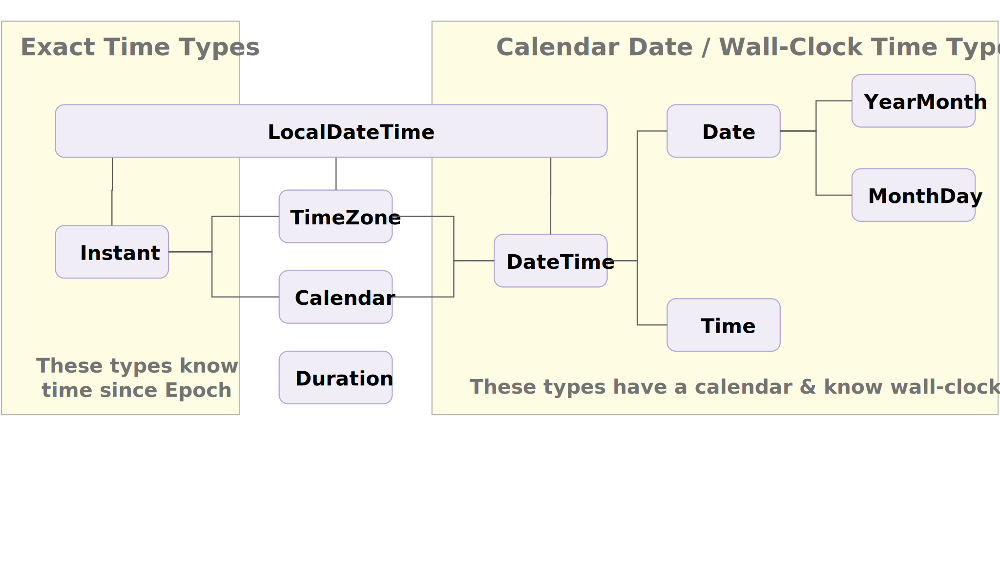
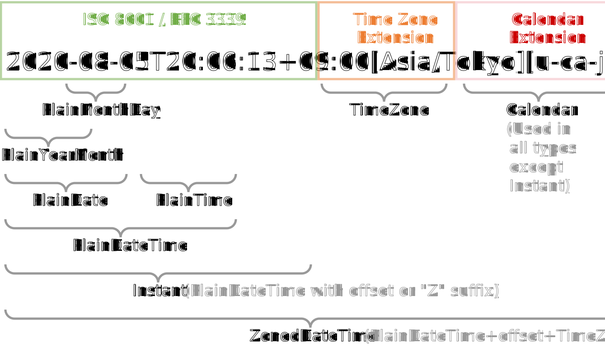

# Temporal

<details>
  <summary><strong>Table of Contents</strong></summary>
<!-- toc -->
</details>

## Introduction

`Date` has been a long-standing pain point in ECMAScript.
This is a proposal for `Temporal`, a global `Object` that acts as a top-level namespace (like `Math`), that brings a modern date/time API to the ECMAScript language.
For a detailed look at some of the problems with `Date`, and the motivations for Temporal, see:
[Fixing JavaScript Date](https://maggiepint.com/2017/04/09/fixing-javascript-date-getting-started/).

Temporal fixes these problems by:

- Providing easy-to-use APIs for date and time computations
- First-class support for all time zones, including DST-safe arithmetic
- Dealing only with objects representing fixed dates and times
- Parsing a strictly specified string format
- Supporting non-Gregorian calendars

Temporal provides separate ECMAScript classes for date-only, time-only, and other scoped use cases. This makes code more readable and prevents bugs caused by incorrectly assuming 0, UTC, or the local time zone for values that are actually unknown.

## Cookbook

A cookbook to help you get started and learn the ins and outs of Temporal is available [here](./cookbook.md).

## API Documentation

The Temporal API follows a convention of using types whose names start with "Plain" (like `Temporal.PlainDate`, `Temporal.PlainTime`, and `Temporal.PlainDateTime`) for objects which do not have an associated time zone.
Converting between such types and exact time types (`Temporal.Instant` and `Temporal.ZonedDateTime`) can be ambiguous because of time zones and daylight saving time, and the Temporal API lets developers configure how this ambiguity is resolved.

Several important concepts are explained elsewhere: [exact time, wall-clock time, time zones, DST, handling ambiguity, and more](./ambiguity.md).

### **Temporal.Now**

- `Temporal.Now.instant()` - get the current system exact time
- `Temporal.Now.timeZoneId()` - get the current system time zone
- `Temporal.Now.zonedDateTime(calendar)` - get the current date and wall-clock time in the system time zone and specified calendar
- `Temporal.Now.zonedDateTimeISO()` - get the current date and wall-clock time in the system time zone and ISO-8601 calendar
- `Temporal.Now.plainDate(calendar)` - get the current date in the system time zone and specified calendar
- `Temporal.Now.plainDateISO()` - get the current date in the system time zone and ISO-8601 calendar
- `Temporal.Now.plainTimeISO()` - get the current wall-clock time in the system time zone and ISO-8601 calendar
- `Temporal.Now.plainDateTime(calendar)` - get the current system date/time in the system time zone, but return an object that doesn't remember its time zone so should NOT be used to derive other values (e.g. 12 hours later) in time zones that use Daylight Saving Time (DST).
- `Temporal.Now.plainDateTimeISO()` - same as above, but return the DateTime in the ISO-8601 calendar

```js
console.log('Initialization complete', Temporal.Now.instant());
// example output:
// Initialization complete 2021-01-13T20:57:01.500944804Z
```

See [Temporal.Now Documentation](./now.md) for detailed documentation.

### **Temporal.Instant**

A `Temporal.Instant` represents a fixed point in time (called **"exact time"**), without regard to calendar or location, e.g. July 20, 1969, at 20:17 UTC.
For a human-readable local calendar date or clock time, use a `Temporal.TimeZone` and `Temporal.Calendar` to obtain a `Temporal.ZonedDateTime` or `Temporal.PlainDateTime`.

```js
const instant = Temporal.Instant.from('1969-07-20T20:17Z');
instant.toString(); // => '1969-07-20T20:17:00Z'
instant.epochMilliseconds; // => -14182980000
```

See [Temporal.Instant Documentation](./instant.md) for detailed documentation.

### **Temporal.ZonedDateTime**

A `Temporal.ZonedDateTime` is a timezone-aware, calendar-aware date/time object that represents a real event that has happened (or will happen) at a particular exact time from the perspective of a particular region on Earth, e.g. December 7th, 1995 at 3:24 AM in US Pacific time (in Gregorian calendar).
This type is optimized for use cases that require a time zone, including DST-safe arithmetic and interoperability with RFC 5545 (iCalendar).

```js
const zonedDateTime = Temporal.ZonedDateTime.from({
  timeZone: 'America/Los_Angeles',
  year: 1995,
  month: 12,
  day: 7,
  hour: 3,
  minute: 24,
  second: 30,
  millisecond: 0,
  microsecond: 3,
  nanosecond: 500
}); // => 1995-12-07T03:24:30.0000035-08:00[America/Los_Angeles]
```

As the broadest `Temporal` type, `Temporal.ZonedDateTime` can be considered a combination of `Temporal.TimeZone`, `Temporal.Instant`, and `Temporal.PlainDateTime` (which includes `Temporal.Calendar`).

See [Temporal.ZonedDateTime Documentation](./zoneddatetime.md) for detailed documentation.

### **Temporal.PlainDate**

A `Temporal.PlainDate` object represents a calendar date that is not associated with a particular time or time zone, e.g. August 24th, 2006.

```js
const date = Temporal.PlainDate.from({ year: 2006, month: 8, day: 24 }); // => 2006-08-24
date.year; // => 2006
date.inLeapYear; // => false
date.toString(); // => '2006-08-24'
```

This can also be converted to partial dates such as `Temporal.PlainYearMonth` and `Temporal.PlainMonthDay`.

See [Temporal.PlainDate Documentation](./plaindate.md) for detailed documentation.

### **Temporal.PlainTime**

A `Temporal.PlainTime` object represents a wall-clock time that is not associated with a particular date or time zone, e.g. 7:39 PM.

```js
const time = Temporal.PlainTime.from({
  hour: 19,
  minute: 39,
  second: 9,
  millisecond: 68,
  microsecond: 346,
  nanosecond: 205
}); // => 19:39:09.068346205

time.second; // => 9
time.toString(); // => '19:39:09.068346205'
```

See [Temporal.PlainTime Documentation](./plaintime.md) for detailed documentation.

### **Temporal.PlainDateTime**

A `Temporal.PlainDateTime` represents a calendar date and wall-clock time that does not carry time zone information, e.g. December 7th, 1995 at 3:00 PM (in the Gregorian calendar).

It can be converted to a `Temporal.ZonedDateTime` using a `Temporal.TimeZone`.
For use cases that require a time zone, especially using arithmetic or other derived values, consider using `Temporal.ZonedDateTime` instead because that type automatically adjusts for Daylight Saving Time.

```js
const dateTime = Temporal.PlainDateTime.from({
  year: 1995,
  month: 12,
  day: 7,
  hour: 15
}); // => 1995-12-07T15:00:00
const dateTime1 = dateTime.with({
  minute: 17,
  second: 19
}); // => 1995-12-07T15:17:19
```

See [Temporal.PlainDateTime Documentation](./plaindatetime.md) for detailed documentation.

### **Temporal.PlainYearMonth**

A date without a day component.
This is useful to express things like "the October 2020 meeting".

```js
const yearMonth = Temporal.PlainYearMonth.from({ year: 2020, month: 10 }); // => 2020-10
yearMonth.daysInMonth; // => 31
yearMonth.daysInYear; // => 366
```

See [Temporal.PlainYearMonth Documentation](./plainyearmonth.md) for detailed documentation.

### **Temporal.PlainMonthDay**

A date without a year component.
This is useful to express things like "Bastille Day is on the 14th of July".

```js
const monthDay = Temporal.PlainMonthDay.from({ month: 7, day: 14 }); // => 07-14
const date = monthDay.toPlainDate({ year: 2030 }); // => 2030-07-14
date.dayOfWeek; // => 7
```

See [Temporal.PlainMonthDay Documentation](./plainmonthday.md) for detailed documentation.

### **Temporal.Duration**

A `Temporal.Duration` expresses a length of time, e.g. 5 minutes and 30 seconds.
This is used for date/time arithmetic and for measuring differences between `Temporal` objects.

```js
const duration = Temporal.Duration.from({
  hours: 130,
  minutes: 20
});

duration.total({ unit: 'second' }); // => 469200
```

See [Temporal.Duration Documentation](./duration.md) for detailed documentation.

#### Balancing

Unlike the other Temporal types, the units in `Temporal.Duration` don't naturally wrap around to 0: you may want to have a duration of "90 minutes," and you don't want it to unexpectedly turn into "1 hour and 30 minutes."

See [Duration balancing](./balancing.md) for more on this topic.

### **Temporal.TimeZone**

A `Temporal.TimeZone` represents an IANA time zone, a specific UTC offset, or UTC itself.
Time zones translate from a date/time in UTC to a local date/time.
Because of this `Temporal.TimeZone` can be used to convert between `Temporal.Instant` and `Temporal.PlainDateTime` as well as finding out the offset at a specific `Temporal.Instant`.

It is also possible to implement your own time zones.

```js
const timeZone = Temporal.TimeZone.from('Africa/Cairo');
timeZone.getInstantFor('2000-01-01T00:00'); // => 1999-12-31T22:00:00Z
timeZone.getPlainDateTimeFor('2000-01-01T00:00Z'); // => 2000-01-01T02:00:00
timeZone.getPreviousTransition(Temporal.Now.instant()); // => 2014-09-25T21:00:00Z
timeZone.getNextTransition(Temporal.Now.instant()); // => null
```

See [Temporal.TimeZone Documentation](./timezone.md) for detailed documentation.
A conceptual explanation of handling [time zones, DST, and ambiguity in Temporal](./ambiguity.md) is also available.

### **Temporal.Calendar**

A `Temporal.Calendar` represents a calendar system.
Most code will use the ISO 8601 calendar, but other calendar systems are available.

Dates have associated `Temporal.Calendar` objects, to perform calendar-related math.
Under the hood, this math is done by methods on the calendars.

It is also possible to implement your own calendars.

```js
const cal = Temporal.Calendar.from('iso8601');
const date = cal.dateFromFields({ year: 1999, month: 12, day: 31 }, {});
date.monthsInYear; // => 12
date.daysInYear; // => 365
```

See [Temporal.Calendar Documentation](./calendar.md) for detailed documentation.

## Object relationship



## String persistence, parsing, and formatting

All `Temporal` types have a string representation for persistence and interoperability.
The correspondence between types and machine-readable strings is shown below.
For more information about string parsing, serialization, and formatting in `Temporal` (including how Temporal is using industry standards like ISO 8601 and RFC 3339), see [String Parsing, Serialization, and Formatting](./strings.md).



## Other documentation

- [Ambiguity](./ambiguity.md) &mdash; Explanation of missing times and double times due to daylight saving and time zone changes.
- [Balancing](./balancing.md) &mdash; Explanation of when `Temporal.Duration` units wrap around to 0 and when they don't.
- [Why do Temporal instances have a Calendar?](./calendar-review.md) &mdash; Background about why types like `Temporal.PlainDate` or `Temporal.ZonedDateTime` contain a calendar.
  These extensions are being actively worked on with IETF to get them on a standards track.
