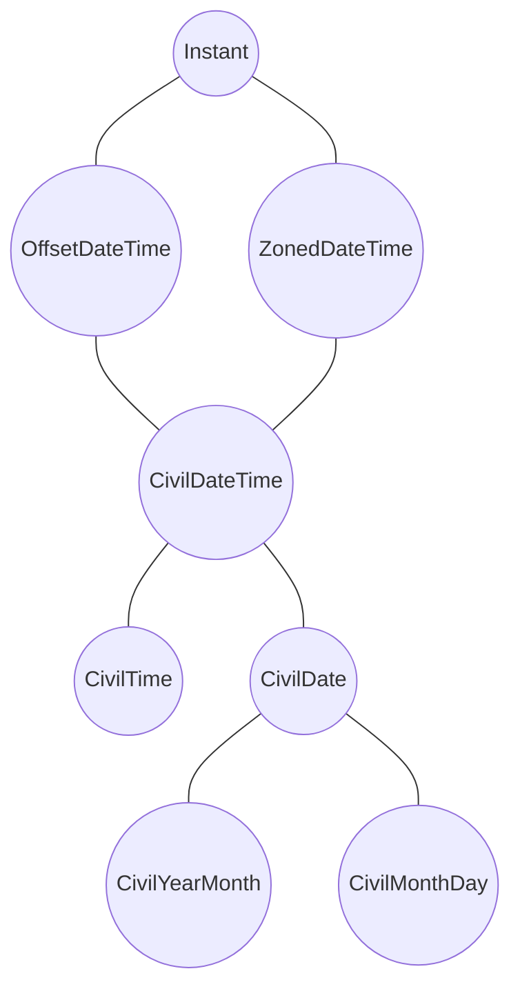
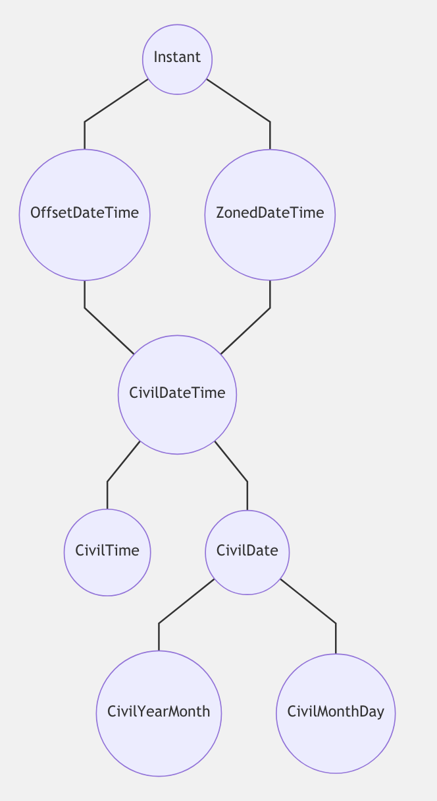

# Mental Object Model

The temporal proposal works within a specific mental model of objects. These represent very specific concepts and a hierarchy of interaction. The following diagram should illustrate the relationships:

Before continuing I'd also like to call out the following API principles to keep in mind when evaluating the proposal:

1. All objects are immutable
2. Methods beginning with `with` will result in objects that contain equal or more data and are therefore safe in terms of losing information.
3. Methods beginning with `get` will result in retrieving an aspect of the object. Thus the value retrieved will have less information that the original object.
4. The calculation methods `plus`, `minus`, and `difference` act with or result in objects of the same type. `difference` is only permissible with objects of the same information content, while `plus` and `minus` are permissible only with `Durations` (or objects containing the same level of information) generated using the `difference` method.

**Please also see the detailed [API description of these temporal objects](objects.md)!!!**

## Instant

`Instant` objects are meant to represent a specific point in absolute time. For convenience we have chosen that point to be *midnight of January the 1st 1970 UTC* as our *epoch*. The choice fell upon that specific date and time due to the precendent of the [POSIX Epoch](http://pubs.opengroup.org/onlinepubs/9699919799/basedefs/V1_chap03.html#tag_03_150) and Unix Epoch based on it.

We decided to ignore  leap seconds since they are arbitrarily decided upon and unpredictable. An `Instant` can therefore not be said to be on the TAE timeline, but rather on the UTC timeline. In terms of leap-seconds we accept them a input (`fromString`) but immediately convert them to the relevant numeric representation and therefore ignoring the fact that this came from a leap-second.

Because `Instant` is just a point in time, it has no concept of calendars or time-units as we use in civil society, the `Instant` objects do not have members representing these either.

Conceptually `Instant`s are not geopgraphically tied to any place. They are equally valid on Mars and Venus as on earth.

## OffsetDateTime

`OffsetDateTime` objects represent a point in time together with a specific offset from UTC. Given that these offets are only valid on Earth, they are tied to a place. However they do not have a time zone or daylight saving adjustments.

As such they can be considered at best to be tied to the planet Earth rather than a specific locality. However because they are tied to the planet, they do have a concept of time units uch as hours and days. And because we restrict ourselves to the proleptic gregorian calendar, they do have months and years that correspond with our western understanding of these ideas.

## ZonedDateTime

`ZonedDateTime` objects represent a point in time in a specific IANA timezone. Since these timezones are tied to a specific locality (city/state/country), these are more precise and observe daylight savings changes.

They also have a concept of time units and are most like what the current `Date` object provides, with the exception of the timezone being a specified value rather that magically intuited from system information.

## CivilDateTime

Contrary to `ZonedDateTime` and `OffsetDateTime` the `CivilDateTime` objects are not tied to an absolute point in time. An example for this would be the statement *the next new year is at 2020-01-01T00:00:00.000000000*. This is true independent of where on the planet one is and independent of any locality. It also represents a different point in time when combined with a timezone:

 * Berlin: `2019-12-31T23:00:00.000000000Z`
 * London: `2020-01-01T00:00:00.000000000Z`
 * New York: `2020-01-01T05:00:00.000000000Z`

## CivilDate

This contain just the date part. It can be mentally considered the *leaf of a desk-calendar*. It can be placed anywhere on the planet, can mean any time within the 24-hour day, but the extent of the time period cannot be acurately specified as it has a different meaning in Australia and Europe for example.

This has usually been represented by abusing a datetime object of some sort. However this leads to all kinds of problems when doing date/time maths. This is a more accurate and specific representation of the concept.

## CivilTime

This represents a time without a date or relation to a specific location. 12:00:00 is noon every day and in every place. It can be considered like the display of an unwound watch. It is on the wrist of a wearer, and unless someone adjusts it, winds it or otherwise influences it, it will be stable, but devoid of meaning relative to any actual timeline.

## CivilYearMonth

This represents an entire month of a year. It's an incomplete date, but is nevertheless useful in many contexts. An example use would be the statement: *By January 2020 we want to have completed the temporal specification*

In terms of interoperability, the TAG review yielded the information that HTML form elements can yield dates like this. And this concept is included in other specifications. To provide a full and compatible set of objects we determined that it was within scope of this proposal to include this type.

## CivilMonthDay

Similarly this is a day and month without a year. An example would be *new years day* / *the 1st of January* where the year is considered irelevant as it is a valid statement for any year.

In terms of interoperability, the TAG review yielded the information that HTML form elements can yield dates like this. And this concept is included in other specifications. To provide a full and compatible set of objects we determined that it was within scope of this proposal to include this type.

## Durations

`Duration` objects are only yielded by taking the difference between two like temporal objects. Durations are always absolute values and can be used for date/time maths using the `plus` and `minus` operation on temporal objects.

The danger with these objects is that they can incorreclty be applied to unlike objects. Consider applying the difference between `2019-01-02T12:00:00.000000000` and `2019-02-02T13:00:00.000000000` which is `1month 1hour` to a date of `2019-05-01` which drops the hours entirely or a time of `15:00:00.000000000` which ignores the month.

So while we strive to enable correct date/time maths, we do not consider it within scope of this proposal to create a system that prevents incorrect date/time maths.
